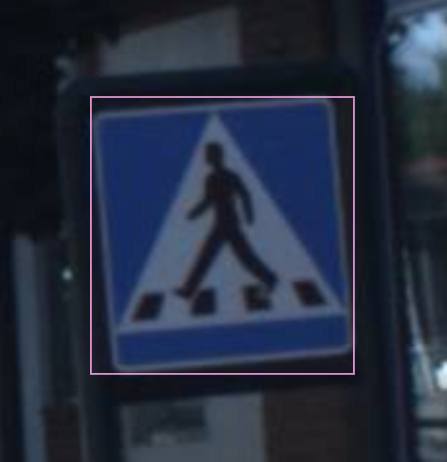
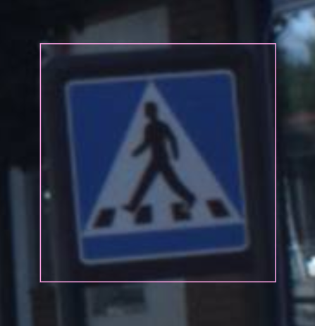
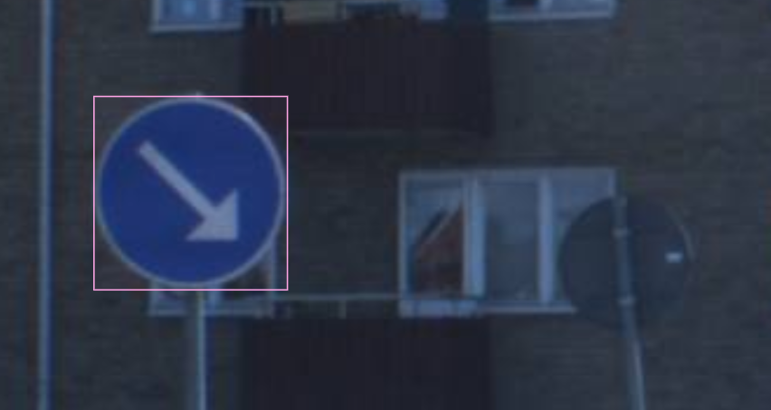
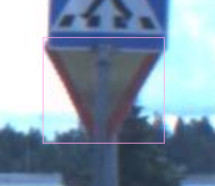
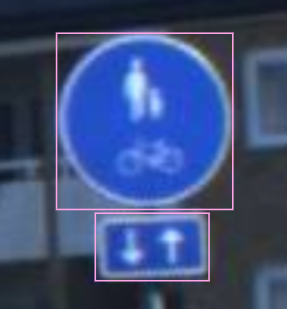
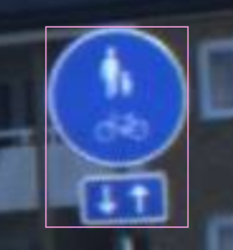
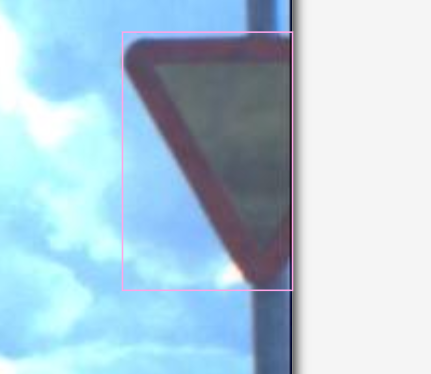
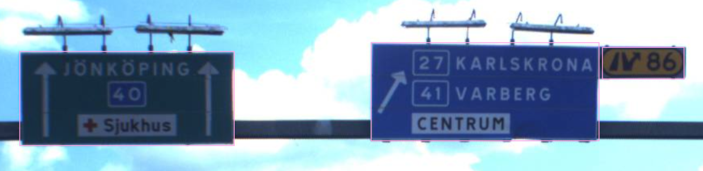

# ТЗ для разметки знаков
### Инструмент 
Я предлагаю вам использовать CVAT для разметки моих изображений. Инструкцию по его установке вы можете найти по [ссылке](https://opencv.github.io/cvat/docs/administration/basics/installation/)

### Данные 
Данные для разметки вы можете скачать по [ссылке](https://disk.yandex.ru/d/a3huVFxFLSNN7w)

### После установки необходимо запустить контейнер с CVAT
После запуска первое что делаем это переходим в проекты и создаем там новый проект, а в качестве меток классов заполняем:
```json
[
  {
    "name": "100_SIGN",
    "id": 1,
    "color": "#e1a7cb",
    "type": "rectangle",
    "attributes": []
  },
  {
    "name": "110_SIGN",
    "id": 2,
    "color": "#6a2064",
    "type": "rectangle",
    "attributes": []
  },
  {
    "name": "120_SIGN",
    "id": 3,
    "color": "#58884d",
    "type": "rectangle",
    "attributes": []
  },
  {
    "name": "30_SIGN",
    "id": 4,
    "color": "#98680a",
    "type": "rectangle",
    "attributes": []
  },
  {
    "name": "50_SIGN",
    "id": 5,
    "color": "#3c7eae",
    "type": "rectangle",
    "attributes": []
  },
  {
    "name": "60_SIGN",
    "id": 6,
    "color": "#3e5135",
    "type": "rectangle",
    "attributes": []
  },
  {
    "name": "70_SIGN",
    "id": 7,
    "color": "#e9e87c",
    "type": "rectangle",
    "attributes": []
  },
  {
    "name": "80_SIGN",
    "id": 8,
    "color": "#e11ed6",
    "type": "rectangle",
    "attributes": []
  },
  {
    "name": "90_SIGN",
    "id": 9,
    "color": "#ff0a6e",
    "type": "rectangle",
    "attributes": []
  },
  {
    "name": "GIVE_WAY",
    "id": 10,
    "color": "#97230f",
    "type": "rectangle",
    "attributes": []
  },
  {
    "name": "NO_PARKING",
    "id": 11,
    "color": "#09a6fa",
    "type": "rectangle",
    "attributes": []
  },
  {
    "name": "NO_STOPPING_NO_STANDING",
    "id": 12,
    "color": "#11e1d3",
    "type": "rectangle",
    "attributes": []
  },
  {
    "name": "OTHER",
    "id": 13,
    "color": "#51b90a",
    "type": "rectangle",
    "attributes": []
  },
  {
    "name": "PASS_EITHER_SIDE",
    "id": 14,
    "color": "#8d8862",
    "type": "rectangle",
    "attributes": []
  },
  {
    "name": "PASS_LEFT_SIDE",
    "id": 15,
    "color": "#9c4c86",
    "type": "rectangle",
    "attributes": []
  },
  {
    "name": "PASS_RIGHT_SIDE",
    "id": 16,
    "color": "#5f8e43",
    "type": "rectangle",
    "attributes": []
  },
  {
    "name": "PEDESTRIAN_CROSSING",
    "id": 17,
    "color": "#caccbc",
    "type": "rectangle",
    "attributes": []
  },
  {
    "name": "PRIORITY_ROAD",
    "id": 18,
    "color": "#1917a6",
    "type": "rectangle",
    "attributes": []
  },
  {
    "name": "STOP",
    "id": 19,
    "color": "#700080",
    "type": "rectangle",
    "attributes": []
  },
  {
    "name": "URDBL",
    "id": 20,
    "color": "#0a3925",
    "type": "rectangle",
    "attributes": []
  }
]
``` 
Классы представляют из себя следющее:
```json
{
    "100_SIGN": "Скорость 100 км/ч", # Ограничение скорости*
    "110_SIGN": "Скорость 110 км/ч",
    "120_SIGN": "Скорость 120 км/ч",
    "30_SIGN": "Скорость 30 км/ч",
    "50_SIGN": "Скорость 50 км/ч",
    "60_SIGN": "Скорость 60 км/ч",
    "70_SIGN": "Скорость 70 км/ч",
    "80_SIGN": "Скорость 80 км/ч",
    "90_SIGN": "Скорость 90 км/ч",
    "GIVE_WAY": "Уступите дорогу",
    "NO_PARKING": "Запрещена парковка",
    "NO_STOPPING_NO_STANDING": "Запрещена остановка и стоянка",
    "OTHER": "Другие знаки",
    "PASS_EITHER_SIDE": "Проезд возможен с любой стороны",
    "PASS_LEFT_SIDE": "Проезд возможен слева",
    "PASS_RIGHT_SIDE": "Проезд возможен справа",
    "PEDESTRIAN_CROSSING": "Пешеходный переход",
    "PRIORITY_ROAD": "Дорога с приоритетом",
    "STOP": "Стоп",
    "URDBL": "Запрещено разворачиваться"
}
```
Подробнее знаки на шведских дорогах вы можете изучить по [ссылке](https://en.wikipedia.org/wiki/Road_signs_in_Sweden)

## Правила разметки:
Необходимо размечать знаки ровно по их границе, не надо включать в разметку различные окантовки, не имеющие отношение к знаку.
Примеры: 
<div style="display: flex; justify-content: space-between; width: 100%;">
    <figure style="text-align: center;">
        
        <figcaption>Правильно</figcaption>
    </figure>
    <figure style="text-align: center;">
        
        <figcaption>Неправильно</figcaption>
    </figure>
</div>
Не нужно включать знаки, которые повернуты противоположной стороной:
<div style="display: flex; justify-content: space-between; width: 100%;">
    <figure style="text-align: center;">
        
        <figcaption>Правильно</figcaption>
    </figure>
    <figure style="text-align: center;">
        
        <figcaption>Неправильно</figcaption>
    </figure>
</div>
Можно размечать знаки которые частично закрыты, если вы уверены в том, что можете однозначно идентифицировать данный знак. Обратите внимание, что разметка осуществляется по предопологаемой границе объекта.
<div style="display: flex; justify-content: center; width: 100%;">
    <figure style="text-align: center;">
        
        <figcaption>Правильно</figcaption>
    </figure>
</div>
Знаки размечаются по своей физической границе. Различные знаки, должны быть размечены отдельно.
<div style="display: flex; justify-content: space-between; width: 100%;">
    <figure style="text-align: center;">
        
        <figcaption>Правильно</figcaption>
    </figure>
    <figure style="text-align: center;">
        
        <figcaption>Неправильно</figcaption>
    </figure>
</div>
Можно размечать знаки пересекающие границу изображения если вы можете их определить однозначно.
<div style="display: flex; justify-content: center; width: 100%;">
    <figure style="text-align: center;">
        
        <figcaption>Правильно</figcaption>
    </figure>
</div>
Разметка больших знаков.
<div style="display: flex; justify-content: center; width: 100%;">
    <figure style="text-align: center;">
        
        <figcaption>Правильно</figcaption>
    </figure>
</div>
Не нужно размечать знак, если не можете определить по данному изображению его принадлежность к какому либо из классов, по причине его удаленности.
<div style="display: flex; justify-content: center; width: 100%;">
    <figure style="text-align: center;">
        
        <figcaption>Правильно</figcaption>
    </figure>
</div>


