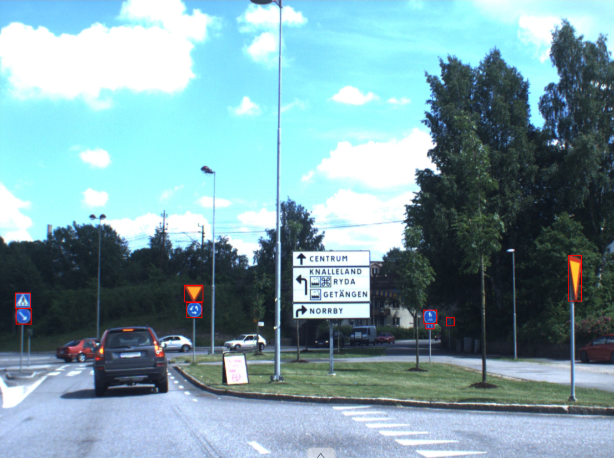

# Результаты
### Фидбек разметчика
Разметчик посчитал ТЗ достаточно наглядным, но не достаточно подробным. Например, он не понимал, может ли он зумить изображение для поиска знаков.
Разметчик посчитал, что это не удобно, изучать целую страницу на википедии, перед разметкой знаков. Можно ли использовать окружающую среду знака для его интерпретации (будем обуждать это на одном из примеров). 
### Метрика
В качестве метрики оценки сходства разметки мы использовали IoU. IoU измеряет степень перекрытия между двумя областями (прямоугольниками в данном случае). Формула для IoU выглядит следующим образом:
$$ IoU = \frac{A_i}{A_u} $$
Где $A_i$ - это площадь области, где разметки пересекаются, а $A_u$ - это общая площадь двух областей. Значение такой дроби лежит между 0 и 1, что очень удобно.
Для рачета метрики был использован самописный скрипт который лежит по следующему пути от корневой директории данного репозитория `annotations/annotations/comparison.py`.

С помощью данного кода было выявлено, что разметка номер 1 имеет 3 объекта, которые отсутсвуют на разметке номер 2. А разметка номер 2 имеет 2 объекта, которые отсутвуют в первой разметке. 

Давайте рассмотрим пример:

    <figure style="text-align: center;">
        
        <figcaption>Моя работа</figcaption>
    </figure>
    <figure style="text-align: center;">
        
        <figcaption>Работа разметчика</figcaption>
    </figure>

Мы видим, что разметчик пропустил огромный знак прямо посреди изображения. Но также можно заметить, что разметик заметил знак, который я при изначальной разметке не смог заметить. Это очень забавно, не заметить огромный знак прямо по центру изображения, но при этом увидеть знак в тени, который видно плохо.
Это изображение служит примером одного из вопросов разметчика, который явным образом не указан в ТЗ. Разметчик смог однозначно идентифицировать знак в тени, который мною был не замечен, только потомучто рядом стоит точно такой же знак. И сравнивая их, он понял, что это тот же самый знак.

Давайте посмотрим оценку IoU для совпадающих по метке и bound box объектов.
Вышеупомянутый код дает нам следующий результат:

Количество совпадающих знаков: 40

Среднее знакчение метрики IoU для этих знаков: 0.906

Количество пропущенных знаков: 5

Тут стоит сказать Аллаху спасибо, что я и мой аннотатор не являемся разметчиками (этот комментарий относится к оценке квалификации разметчиков).

## Вывод
Разметка изображений – сложный процесс, требующий точности и внимания к деталям. Фидбек разметчика выявил некоторые важные аспекты, такие как необходимость более подробных инструкций.

В предоставленном примере сравнения были выявлены отличия между двумя разметками, а именно 3 объекта, которые были упущены в одной разметке и 2 объекта, отсутствующих в другой.

Процесс визуализации результатов, освещенный в примере, позволяет лучше понять, почему возникают расхождения в разметке. Большую роль играет человеческий фактор.

Оценка IoU для совпадающих объектов (в данном случае знаков) предоставляет информацию о степени совпадения между разметками. Полученные значения, такие как среднее значение IoU равное 0.906, свидетельствуют о высокой степени согласованности между объектами.

Общий вывод – совместная работа, обсуждение деталей и использование подходящих метрик играют важную роль в повышении качества разметки изображений. Написание ТЗ должно быть итеративным, это позволяет наилучшим образом использовать опыт ошибок и неточностей.